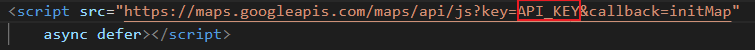

# Google Maps Integration [^IMPORTANT]

## Objectives

1. Integrate a Google Map in a web browser
2. Add a marker
3. Listen to events

[^IMPORTANT]: Note that this is a school project and the API_KEY was provided by the school. If you're using this source code you have to provide this API here

